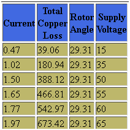
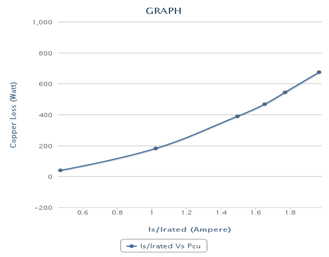

### Procedure

1. Rotor of induction motor is blocked in order to perform block rotor test.
2. Close the TPST (Triple Pole Single Throw) switch connecting three phase mains supply to induction motor.
3. Vary input current from zero to rated value (415V).
4. Observe the readings of voltmeter, ammeter, watt meters and tachometer at different i/p voltages.
5. Now increase the voltage by clicking the arrows on three phase variac

6. Store this data by clicking "Start Storing Data"
7. Go on repeating this procedure till sufficient readings are stored.
8. Now display the data by clicking "Show data".It will display data as shown

9. Now select one of the graph from available graphs and use "Generate graph" to plot the graph. For Ex.

10. Since very low value of voltage can inject rated current under this condition precaution should be taken not to apply high voltages.
11. While switching off, reduce the input voltage to zero and open the TPST switch.